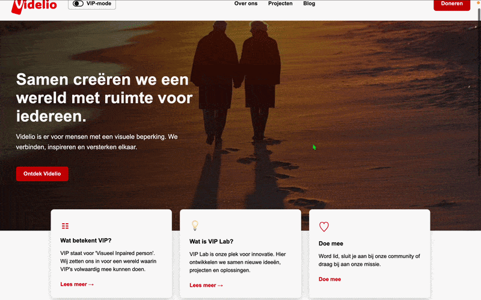
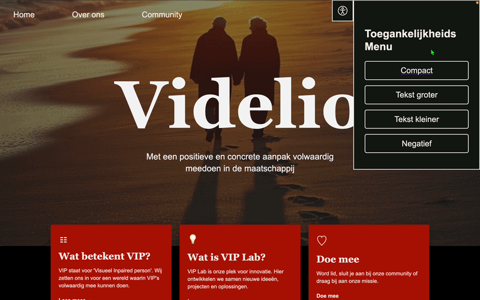

# Meesterschap
DR en PB in de wiki

```text
/
├── public/
│   └── favicon.svg
├── src
│   ├── assets
│   │   └── astro.svg
│   ├── components
│   │   └── Welcome.astro
│   ├── layouts
│   │   └── Layout.astro
│   └── pages
│       └── index.astro
└── package.json
```

# V1.0 - Website eind week 1


Tijdens de test


# Week 2
# Website v2


# Week 3


# Week 4

# Week 5 eind

# Bronnen

- [prefers-color-scheme](https://developer.mozilla.org/en-US/docs/Web/CSS/Reference/At-rules/@media/prefers-color-scheme)
- [foto van hero versie 2 van week 2](https://stockcake.com/i/sunset-beach-walk_1444034_1134779)
- [foto van hero versie 2 van week 2](https://www.magnific.com/free-photos-vectors/older-couple-sunset/2#uuid=d0d06d0e-01af-4097-bd25-c4ba22cf7113)
- [videlio logo](https://videlio.nl/wp-content/uploads/2025/03/Logo-rood-zonder-kader-300x152-1.png)
- AI Is alleen gebruikt voor de structuur/spelling van de meeting notes in de Readme
