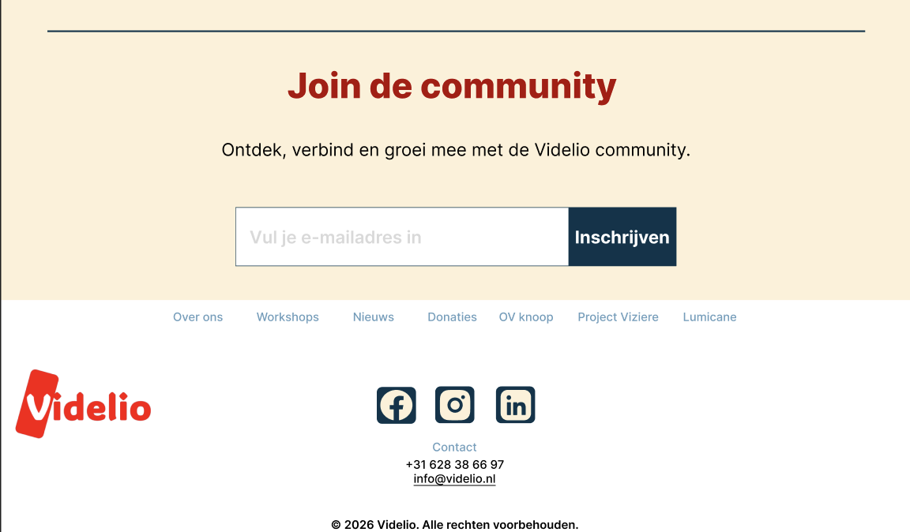
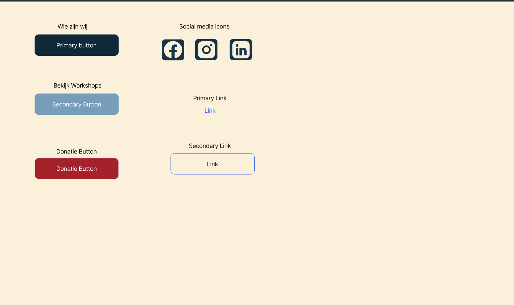
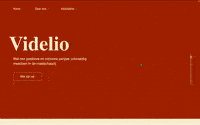
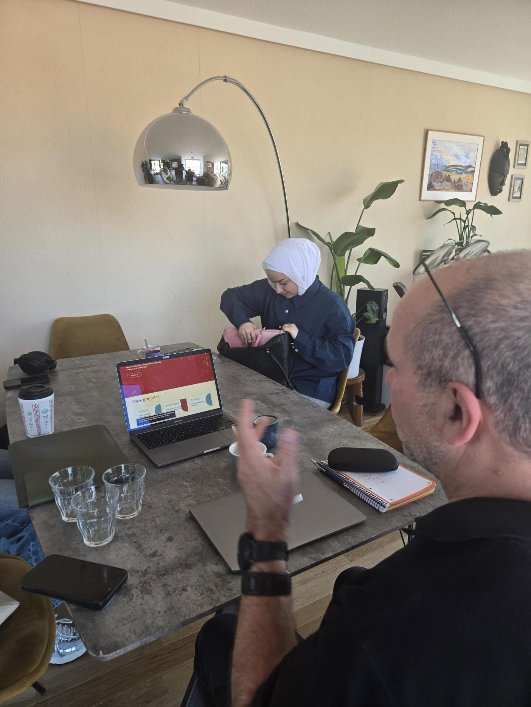

# Meesterschap

# Week 1
## Maandag 18 mei - dag 1
#### Aya B
Vandaag zijn we gestart met de Meesterproef. Nadat de groepjes waren ingedeeld, hebben we als team meteen een Teams-groep aangemaakt om makkelijker met elkaar te communiceren en afspraken te maken.
Daarnaast hebben we een Notion-bestand opgezet. Hierin verzamelen we onze notities, afspraken en taakverdeling. Voor de eerste opdracht hebben we de taken verdeeld rondom het maken van de debrief voor de opdrachtgever.

Ook hebben we een Word-document aangemaakt voor onze design rationale. Dit document gebruiken we om onze keuzes, onderbouwing en processtappen vast te leggen. We zijn begonnen met het invullen van dit document op basis van de taakverdeling die we in Notion hadden gemaakt.

Aan het einde van de dag hebben we de debrief afgerond en alvast vragen opgesteld voor de opdrachtgever. Deze vragen willen we de volgende dag stellen, zodat we een duidelijker en completer beeld krijgen van de opdracht en de verwachtingen.

## Dinsdag 19 mei - dag 2
### Wat hebben we gedaan vandaag?
#### Alisha
Eigenlijk was mijn dag vandaag de miscommunicatie van Vasilis in orde maken.
Ik moest eigenlijk achter alles komen voor duidelijkheid vanuit de docenten zowel als de opdrachtgever (waar het ander team volgens mij geen last van heeft gehad). Gister had Aya A een mail gestuurd naar Roger, hier werdt niets op gereageerd en konden wij als groepje eigenlijk niet verder. Ik heb daarna contact opgenomen met Leonie, maar ik kreeg daar ook geen reactie van. Uiteindelijk heeft Aya A het nummer van Roger gekregen door contact op te nemen met het andere groepje en heb ik met Roger gebeld. Hij gaf aan geen tijd meer te hebben voor een kennismaking vandaag en dat we beter op vrijdag langs kunnen komen om 12 om dit nog steeds te doen en in te halen.
 
##### Mijn dag in het kort:
- Contact met leonie opgenomen -> niets vernomen. Geen reactie op mijn teams berichten of mijn calls. Zelfs als ik het meerdere keren heb geprobeerd. Plan: Leonie hierop aanspreken en duidelijkheid krijgen op deze situatie aangezien zij ons contact persoon is.

- Sanne -> doorverwezen naar Vasilis die toen liet weten dat Vasilis contact op ging nemen met de opdrachtgever.
 
- Vasilis (boosdoener) -> niet goed gecommuniceerd naar Roger dat er nog een 2e groep, mijn groep, mee deed aan het project. Hierdoor kreeg mijn groep helemaal niets te horen over vandaag en konden wij niets doen behalve afvragen waar het fout ging.
 
- Contact met Roger: gaf aan dat de @videlio.nl email niet op zijn telefoon zat en dat hij niet op zijn computer heeft gekeken. (Hoe heeft het andere groepje WEL een reactie van hem gekregen?). Ik heb met Rogeir besproken wat wij nu het beste kunnen doen:

- Wij gaan eerder dan het eerste groepje naar Utrecht om 12 uur
- Roger en Peter op Signal zodat wij op die manier met ze kunnen communiceren
- Aanstaande vrijdag leggen we samen de tijdstippen voor de komende vrijdagen vast.
- Tussen door kunnen we wanneer nodig met signal ook bellen

Tot nu toe ben ik eigenlijk helemaal niet tevreden over hoe het contact met onze coach verloopt, omdat ik via andere docenten moest achterhalen wat het plan was. Ik hoop daarom dat hier in de toekomst verbetering in komt.

#### Aya A
Ik heb vandaag actief bijgedragen aan de voorbereiding van de documenten voor dit project. Ik heb een groepsapp en een Notion bord opgezet, zodat de communicatie en samenwerking tijdens het project overzichtelijk verlopen en alles voor iedereen bijgehouden en terug te vinden is. Daarnaast heb ik belangrijke punten genoteerd en de taken voor de debriefing verdeeld, zodat duidelijk was wie welk onderdeel uitvoert.
Verder heb ik de hoofdvraag, deelvragen en interviewvragen opgesteld. Ook heb ik Roger een email gestuurd met het verzoek om een afspraak in te plannen.

#### Wat gaan we morgen doen
#### Alisha
Taken verdelen over welke pagina's wie gaat maken en wie wat precies gaat doen zodat we op vrijdag een prototype hebben waaar Roger iets mee kan.

## Woensdag 20 mei - dag 3
### Taakverdeling voor vrijdag
#### Aya A
- Footer → ontwerpen en ontwikkelen
- Buttons → ontwerpen en ontwikkelen
Ik heb in Figma een design gemaakt voor de styling van de buttons en de footer. Daarbij heb ik nagedacht over hoe de footer beter gestructureerd en gestyled kan worden, zodat deze overzichtelijker en gebruiksvriendelijker wordt. Dit ontwerp wil ik morgen testen met de opdrachtgever om feedback te verzamelen en eventuele verbeteringen door te voeren.
Vervolgens ben ik aan de slag gegaan met het uitwerken van het design en het omzetten naar code, zodat het visueel ontwerp functioneel wordt op de website.

Daarnaast heb ik via Teams afspraken gemaakt binnen de groep over de aanwezigheid in de ochtend. Dit omdat sommige groepsleden vaak later bij workshops aansluiten of in de ochtend niet aanwezig zijn, waardoor er weinig mogelijkheid is om goed te overleggen of samen te werken. 

  
  
  

#### Aya B
- Nav → ontwerpen en ontwikkelen
- Hero
#### Alisha

- Design maken van de v1 → hero en de project cards ontwerpen
- Ebook section veranderen naar iets anders en ontwikkelen

#### Patoune
- Ervaringen van de community -> ontwerpen en ontwikkelen
- Sluit je aan bij de community section -> ontwerpen en ontwikkelen

Ik heb vandaag geholpen met voorbereiden van ons Redesign, en begonnen aan de debriefing van de opdracht/

### Wat hebben we gedaan vandaag?
#### Alisha
De workshop van Leonie gedaan:

- Schrijf op wat de uitkomsten zijn van de tests
- Voor de tweede week een testpersoon vinden die niet bij Videlio werkt
- 11:30 met Leonie op dinsdag (maandag is een vrije dag)
- Leonie gaf aan dat ze geen teams heeft op haar telefoon waardoor we niets hadden gehoord van haar

#### Aya B
- Twee Git-workshops gevolgd: basiskennis en een verdiepende workshop.
- Meer geleerd over werken met Git binnen een team.
- Geoefend met GitHub Desktop.
- Geleerd dat pull requests eerst reviewed en approved moeten worden voordat ze gemerged worden.
- Verder gewerkt aan het design van het eerste prototype.
- Taken verdeeld voor de eerste versie van het prototype.
- Mijn taak gekozen/opgepakt: de hero section en de navigatiebalk.

#### Patoune
##### Hoe ga je testen? (Leonie)

- behandel elke keer als we hem zien ook als een test
- Het zou handig zijn om over twee weken een andere test in te plannen (die slechtziend is). Omdat Roger en Peter bij de stichting hoort en weten waar het over gaat. Het is handig om te zien of iemand buiten de stichting ook snapt waar het over gaat.
- Gerichte vragen over de doelgroep, jonge mensen of mensen die wel kunnen zien?
- Misschien ook een test met iemand die wel kan zien
- Als je test met een nieuw persoon, is het belangrijk om te vertellen waarom je test, ook zeggen dat ze het niet fout kunnen doen, en open vragen stellen bijv hoe zou je naar deze pagina gaan?
- Je eigen aannames uitleggen en checken of het klopt

##### Doen voor vrijdag
Iets maken wat we denken dat zij goed zouden vinden, alvast een klein prototype maken om te valideren om te kijken of dit goed is.

## Donderdag 21 mei - dag 4

### Wat hebben we gedaan vandaag?

#### Alisha
- Workshop van Sanne
- Pull request reviewed en approved
- WN van Hans
- Overal de planning strakker gemaakt en duidelijkere afspraken binnen het team besproken op initatief van Aya A
- De V1 voor morgen klaar gezet voor Roger

#### Aya B
- Gewerkt aan mijn taak voor het eerste prototype.
- De hero section en navigatiebalk uitgewerkt in code.
- Samen met het team afspraken gemaakt over de workflow.
- Besproken hoe we omgaan met branches, pull requests en reviews.
- Meegeholpen om de planning strakker en duidelijker te maken.
- De eerste versie van het prototype voorbereid voor Roger.
- Weekly Nerd van Hans gevolgd over privacy.

### Workshop/definition of ready of requirements:
code:
- goed commiten die wordt voor iedereen duidelijk zijn(taal bepalen), met goede uitleg over wat hier gedaan wordt.
-Af stemmen over :
     -de classs namen ook qua taal(btn of button)
     -de vorm van arrow function oude vorm of met = >
-gode nesting

gebruikers:
-de gebruiker moet eenvoudig kunnen schakelen tussen fuvi en lovi modus
-de gebruiker moet snel belangrijke informatie kunnen vinden

accessibility:
-de website moet voldoen aan WCAG 2.2 AA
-de website moet volledig bruikbaar zijn met toetsenbordnavigatie.

style:
-De stijl moet modern, menselijk en energiek aanvoelen

-wil een goed plan gaan maken van de ochtend over wat wij gaan maken.

-hoe maken jullie de product userfriendly?

### Doelen voor de gebruikers, wanneer is je project een succes? - Sanne
Lijstje Alisha
Project in het kort: website redesignen met een accessiblity sausje die slechtziende empowered.

- Met je team een lijste maken over de criteria/kwaliteiten voor onder andere
- Code kwaliteit
- Content kwaliteit
- Interactie kwaliteit

Lijstje maken om je werk te reviewen - Alisha:

- Code conventies → kebab-case voor HTML, CSS nesten camelCase voor id’s en js vars
- Toegankelijkheid → contrast
- Gebruik betekenisvolle namen voor componenten / functions / variables / css classes
- maar deel de code op in logische componenten
- **JavaScript conventies: dubbele qoutes voor strings, gebruik semi colons voor elke line van code.**
- Fall back voor high-density screens → meer detail

Lijstje - patoune

Code: 
Semantische html
structuur en logische volgorde
logische naamgeving

Toegankelijkheid:
Goed contrast tekst/buttons
alternatieve tekst bij img
screenreader werkt overal
duidelijke feedback bij knoppen
responsive design
inzoomen

Check wcag: axe accessibility, lighthouse
contrast check: color contrast analyzer

320

Welke schermen gebruiken mensen met een visuele beperkingen

Content kwaliteit: 
alt-teksten bij afbeeldingen
grootte van afbeeldingen
logische volgorde
navigatie logisch en netjes opgebouwd
consistente stijl overal

svg, webp
picture element

#### Wat gaan we morgen doen?

#### Alisha
- 12:00 bij Roger
- Kennismaken met het team/bedrijf
- Testen
- Eindelijk een goed beeld krijgen van wat we moeten doen voor de opdracht

# Vrijdag kennismaken & eerste test
## Vrijdag 22 mei - dag 5
### Aya B
- Afspraak gehad met Roger om 12:00.
- Kennisgemaakt met Roger en Peter.
- Meer context gekregen over Videlio en de doelgroep.
- De eerste versie van het prototype besproken.
- Feedback verzameld op onze eerste richting.

**Meeting notes Aya A**

## Algemeen intro

Slechtziende mensen hebben vaak veel ervaring met websites en toegankelijkheid. Ze willen daarom niet zomaar een goede website, maar een voorbeeld neerzetten van hoe het eigenlijk zou moeten. De doelgroep zijn natuurlijk mensen met een visuele beperking, maar ook organisaties, ondernemers en mensen zonder beperking moeten begrijpen waar Vedilio voor staat.

Roger vertelde dat hij in zijn rechteroog nog ongeveer 1% zicht heeft en in zijn linkeroog ongeveer 40%. Zijn centrale zicht werkt bijna niet meer. Peter ervaart juist het tegenovergestelde zijn centrale zicht is goed, maar het zicht daaromheen is beperkt. Dat verschil liet meteen zien hoe verschillend slechtziendheid kan zijn per persoon.

Tijdens het gesprek viel op dat sommige elementen, zoals pop-ups, mogelijk niet eens worden opgemerkt door gebruikers met beperkt zicht.

Ze vertelden ook dat ze dromen en ambities hebben die ze op een leuke en effectieve manier willen omzetten in de praktijk. Slechtziendheid betekent volgens hen niet dat het leven stopt. Roger gaf als voorbeeld dat hij hardloopt met een begeleider via een lintverbinding. “Je ontdekt vaak dat er veel meer mogelijk is dan je eerst denkt, maar je moet je wel anders leren voorbereiden. Dat proces kan confronterend en soms pijnlijk zijn”.

Ze benoemden ook hoe intensief revalidatietrajecten kunnen zijn, zeker wanneer mensen op jongere leeftijd slechtziend worden. Dat heeft invloed op relaties, werk en het dagelijks leven. 

## Wat zij willen

Ze hebben zelf nieuwe ideeën bedacht voor hoe een website voor VIP’s eruit zou moeten zien. Veel bestaande websites voelen volgens hen als gewone websites waar later een toegankelijkheidslaag overheen is gelegd. Vedilio wil juist een website die vanaf de basis ontworpen voelt voor mensen met een visuele beperking.

Belangrijke punten zijn:

- lettertypes groter kunnen maken
- goede ondersteuning voor screenreaders
- makkelijk van heading naar heading kunnen springen
- minder vermoeidheid tijdens het navigeren.

Bij veel websites moeten screenreadergebruikers eerst door de hele pagina heen voordat duidelijk wordt wat belangrijk is. Dat kost energie.

Ze willen een aantrekkelijke website die niet alleen toegankelijk is, maar ook direct gevoel oproept. Niet alleen uitleggen wat Vedilio aanbiedt, maar vooral uitstralen:

> “Wauw, daar wil ik bij horen.”

Workshops gaan in de toekomst zeker terugkomen. Deze stonden eerder online maar zijn tijdelijk weggehaald. Ze hebben nu een locatie voor workshops, maar zoeken nog naar een beter toegankelijke plek in Eindhoven. Ze gaven zelf aan dat hun ideeën soms verder zijn ontwikkeld dan de praktische realiteit.

Peter benoemde ook dat hij het belangrijk vindt dat bijvoorbeeld zijn vriendin de website ook gewoon prettig kan gebruiken. Daarom ontstond het idee om mogelijk twee versies van de website te maken.

## Huisstijl en uitstraling

Voor mensen met een visuele beperking moet de website strak en overzichtelijk zijn, met grotere letters maar niet overdreven groot. Roger houdt van een moderne en strakke stijl, maar het mag ook speels zijn.

> “Ik bepaal zelf hoe mijn leven eruitziet.”

Ze ervaren dat er in de wereld van slechtziendheid vaak voor mensen wordt gedacht en gezorgd. Vedilio wil juist autonomie uitstralen.

Roger gaf als voorbeeld  de bijeenkomst bij de gemeente Eindhoven overdag gesprekken over toegankelijkheid en daarna samen informeel borrelen. Daarmee willen ze laten zien dat mensen met een beperking niet automatisch “geholpen” hoeven te worden, maar gewoon onderdeel zijn van de samenleving.

Ze willen absoluut niet uitstralen dat mensen met een visuele beperking zielig zijn of gezien moeten worden als patiënt of dossier. Dat gevoel willen ze juist vermijden in de tone of voice van Vedilio.

## Toegankelijkheid & functionaliteiten

Beide versies van de website moeten uiteindelijk dezelfde inhoud bevatten, maar de screenreaderversie mag werken met kortere zinnen en minder visuele afleiding.

Er werd gesproken over een digitale “kamer” of online ruimte waarin geluid mogelijk een rol kan spelen, bijvoorbeeld subtiele achtergrondgeluiden zoals de zee. Tegelijkertijd moet dat nooit storend worden. Audio of geluidseffecten moeten dus altijd optioneel zijn.

Misschien kan er gewerkt worden met shortcuts of toegankelijkheidsopties die gebruikers zelf aan of uit kunnen zetten.

Ze staan open voor innovatieve ideeën zolang deze niet storend of vermoeiend zijn.

## Community & content

Vedilio wil dat mensen uit de VIP community zelf actief bijdragen aan het platform. Bijvoorbeeld door podcasts te maken over onderwerpen rondom slechtziendheid.

“Join the community” moet verwijzen naar een laagdrempelig contactformulier of een manier om eenvoudig contact op te nemen. Mogelijk ook via inspreken/audio-input, zodat het toegankelijker wordt voor mensen met een leesbeperking.

Dode links of onduidelijke navigatie moeten absoluut voorkomen worden.

Vanaf het eerste moment moet de website uitstralen

> “Hier gebeurt iets bijzonders.”

Niet alleen informeren, maar mensen echt aantrekken.

## Verwachtingen & haalbaarheid

De boodschap en uitstraling van de website zijn het belangrijkst. Er moeten duidelijke routes komen voor verschillende bezoekers, bijvoorbeeld:

- “Ik ben net slechtziend geworden”
- “Wat heeft Vedilio mij te bieden?”
- “Ik zoek een community”
- “Ik wil mezelf ontwikkelen”

Belangrijke pijlers zijn:

- media & podcasts
- persoonlijke ontwikkeling
- community
- workshops & activiteiten

Ze gaan de komende dagen nadenken over hoe de aanmeldprocedure intern geregeld kan worden.

## Aanvullende inzichten uit het gesprek

Tijdens het gesprek kwam ook een belangrijke vraag naar voren

> “Is blind zijn erg omdat de maatschappij dat zo ziet, of omdat het echt zo erg is?”
> 

Daarmee wilden ze duidelijk maken dat blindheid of slechtziendheid vaak sociaal zwaarder wordt gemaakt dan nodig is. Mensen met een visuele beperking zijn volgens hen niet zielig, maar gewoon mensen met ambities, dromen en een eigen identiteit.

Ze gaven aan dat veel bestaande websites technisch toegankelijk proberen te zijn, maar uiteindelijk alsnog gebouwd zijn vanuit een ziende gebruiker. Er wordt vaak een toegankelijkheidslaag eroverheen geplakt, terwijl Vedilio juist een platform wil dat vanaf de basis ontworpen is voor VIP’s en empowerment centraal zet.

Een belangrijk probleem bij screenreaders is dat gebruikers vaak eerst door lange headers, menu’s en teksten heen moeten voordat duidelijk wordt waar de website eigenlijk over gaat. Pas nadat alle details zijn voorgelezen ontstaat overzicht. Daarom ontstond het idee voor een soort schaduwwebsite een compacte versie die speciaal gericht is op screenreaders en snel context geeft over Vedilio.

De website moet direct het gevoel oproepen

> “Wow, hier wil ik bij horen.”
> 

Dat gevoel is belangrijker dan meteen uitleggen welke diensten of activiteiten worden aangeboden.

Er werd ook gesproken over verschillende modi of weergaven

- een standaardversie voor de gemiddelde bezoeker
- een VIP versie met grotere tekst, rustiger ontwerp en optimalisatie voor screenreaders.

qua stijl vinden ze een strakke website belangrijk, grote tekst mag aanwezig zijn, maar het moet niet overdreven  aanvoelen.

Ze stonden opvallend open voor experimenten met geluid op de website. Het idee van een digitale kamer of ruimte kwam meerdere keren terug. Geluid zou gebruikt kunnen worden om sfeer neer te zetten, bijvoorbeeld met subtiele soundscapes. Tegelijkertijd benadrukten ze dat geluid snel storend kan worden, zeker voor screenreadergebruikers die audio vaak versneld afspelen rust blijft daarom belangrijk.

Hun houding hierin was

> “Verras ons maar.”
> 

Maar wel met de voorwaarde dat alles functioneel en niet overprikkelend blijft.

qua visuele voorkeuren noemden ze rood als een kleur die hen aanspreekt.

Ook werd benoemd dat knoppen en interacties goed getest moeten worden voor screenreaders en eventuele switches of toegankelijkheidsbediening.

- de huidige website bevat te veel dode links
- de aanmeldprocedure is momenteel het grootste praktische probleem
- de compacte/screenreaderversie vooral behoefte heeft aan korte teksten, duidelijke samenvattingen en weinig afleiding
- workshops komen binnenkort weer terug op de websit

## Vrijdag kennismaken & eerste test - 22 mei 2026

**meeting notes Alisha**

Over Roger

- beeldend kunstenaar
- ziet 1% in zijn linker oog en 40% in zijn rechter oog

Over Peter

- buisje wordt steeds slechter
- Zijn brein maakt het plaatje compleet

is blind zijn erg omdat het sociaal zo wordt gezien of omdat dat ook echt zo is?

Eigenlijk is blind zijn niet zielig, ze zijn ook gewoon mensen met dromen. 

Websites zijn er maar daar zit een toegangkelijkheids sausje overheen en zijn eigenlijk niet gebouwd voor blinden. 

Geen sausje gewoon gebouwd voor VIPS om ze te empoweren

- screen reader gaat eerst door de header
- eerst door lange verhalen te gaan voordat je de context van de website door hebt
- pas overzicht als je door alle details bent gegaan
- Wow hier wil ik bij horen dit is voor mij → vibe voor de website
- schaduw website die kort is die gericht is op screen readers → snel de context van de website
- Schakkel modes → eerste is voor de gemiddelde persoon
- Voor vips → strakke website met niet te grote maar wel grote tekst

- Geluid op de website? ze staan er voor open “veras ons maar”
- kamer gedachte → digitale kamer/ruimte
- Geluid zou interesant kunnen zijn voor experimenteren op de pagina
- Als blinden kosten onze actieviteiten meer moeite
- Geluid als een sfeer beeld → als ik denk aan geluid dan denk ik aan een screen reader die 2x zo snel uitspreekt.
- Houd het zo rustig mogelijk VS  met een soort soundscapes kan je ook een sfeer neer zetten die heel goed bij videlio werkt
- voorzichtig zijn want je wil het niet storend maken waar het kan ook niet toevoegen.

Rood vinden ze wel mooi
Knop die in de screen reader terug komt
Testen met knoppen voor de switch

**Meeting notes Patoune**

- Wat zij graag willen: een gewone aantrekkelijke website.
Uitstraling: Dit gaat over mij, niet alleen toegankelijkheid sausje maar dat er een schaduw-website naast staat. Videlio staat hier voor, dus niet dit bieden we aan, meer wow dit is leuk, hier wil ik bij horen
- Redesign, focus op: Fysieke Toegankelijkheid, viplab
- Huidige website: De dode links, aanmeld procedure is het moeilijkst
- Voor de compacte versie is korte tekst, geen plaatjes en goede samenvatting belangrijk (Het is handig om een introductie ook uit te leggen als je door een screenreader gaat)
- Voor de workshop pagina: Er komen nog workshops aan. Dat is een plek in Eindhoven.
- Belangrijk - als je voor het eerst op de site komt, wow hier gebeurt wat, hier wil ik bij aansluiten. Dit beiden wij aan, doe hier aan mee.

# V1.0 - Website eind week 1

Tijdens de test


# Week 2
## Dinsdag 26 mei - dag 6
- Meeting met projectcoach om 11:30
- Scrum -> weten waar iedereen mee bezig is
- Doel voor deze week?
- Berend vragen of hij ons prototype wil testen zodat we een extra test hebben buiten het bedrijf
- Online of IRL, is aan jullie. IRL heeft wel voorkeur want dan kan je zien hoe ze dingen doen
- roadmap -> mijlpalen stellen tijdens het project, trello gebruiken?

- Din: alle html pagina's opzetten
- Woe: css/styling van de pagina's
- Do: js en vragen bedenken voor het prototype
- Vr: prototype testen

Sitemap v2:
```
videlio/
			├── blog.html
			│   ├── nieuws.html
			│   ├── radio.html
			│   ├── ebook.html
			│   └── podcast.html
			├── projecten.html
			├── over_ons.html
			└── index.html
```

## Woensdag 27 mei - dag 7
## **JavaScript voor medium+ Workshop - Jad**

##### Alisha
Een paar kleine oefeningen in JS om je meer te laten oefenen met de functies en de syntax

Opdracht 1

```jsx
function capitalizeWord(word) {
  const trimmed = word.trim();
  return (trimmed[0].toUpperCase() + trimmed.substring(1).toLowerCase());
}

// Sample usage
console.log(capitalizeWord("  sam ")); // "Sam"
console.log(capitalizeWord(" alEX")); // "Alex"

trim() js function = haalt spaties/whitespace weg
[0] voor de eerste letter
toUpperCase() = capitals
word.trim in een const var
```

Opdracht 2

```jsx
function upperEveryItem(items) {
  return items.map(function (item) {
    return item.toUpperCase();
  })
}

console.log(upperEveryItem(["sam", "alex", "maria"])); // ["SAM", "ALEX", "MARIA"]

map() = alle items van de lijst

Arrow function
function upperEveryItem(items) {
  return items.map((item) => {
    return item.toUpperCase();
  })
}

Korte versie met arrow function:
function upperEveryItem(items) {
  return items.map((item) => item.toUpperCase())
}
```

Opdracht 3

```jsx
function firstCharTransform(items) {
  return items.map((item) => {
    return item.toUpperCase()[0];
  })
}

```

forEach return’ed niets een map wel. Dus als je een array hebt kan je map gebruiken om er door te gaan.

Opdracht 4

```jsx
function sumNumbers(items) {
  let sum = 0;
  items.forEach(item => sum += item); 
    return (sum);
}

console.log(sumNumbers([1, 10, 4, 5, 3])); // 23
console.log(sumNumbers([10, 11, 12])); // 33
```

Sum wordt elke itiratie bijgehouden + de waarde van item geeft de totale sum

Dit doet hetzelfde zonder een sum bij te houden:

```jsx
function sumNumbers(items) {
  return (items.reduce(function(total, current) {
    return (total + current);
  }, 0));
}
```

Opdracht 5 Array destructuring

```jsx
function sayHello(details) {
  const [firstName, lastName] = details;

  return `Hello, ${firstName} ${lastName}!`;
}

console.log(sayHello(["John", "Smith"])); // Hello, John Smith!
console.log(sayHello(["Jane", "Doe"])); // Hello, Jane Doe!

```

Opdracht 6 Array destructuring, als je geen last name hebt en die NIET op undefined wil hebben

```jsx
function sayHello(details) {
  const [firstName, lastName = "N/A"] = details;

  return `Hello, ${firstName} ${lastName}!`;
}

```

Opdracht 7 Objects

```jsx
const tweets = [
  {
    id: 1080777336298049537,
    message: "Just shipped a new feature! 🚀",
    author: {
      username: "jad",
      name: "Jad Joubran",
    },
    replies: [
      {
        id: 1080888336298049001,
        message: "Congrats! What does it do?",
        author: {
          username: "sam",
          name: "Sam Green",
        },
      },
      {
        id: 1080888336298049002,
        message: "Amazing work! 🎉",
        author: {
          username: "alex",
          name: "Alex Brown",
        },
      },
    ],
  },
  {
    id: 1080777336298195435,
    message: "What's your favorite JS framework?",
    author: {
      username: "maria",
      name: "Maria Chen",
    },
    replies: [
      {
        id: 1080888336298195001,
        message: "React all the way!",
        author: {
          username: "chris",
          name: "Chris Lee",
        },
      },
    ],
  },
];

function getFirstReplyAuthor(tweet) {
  return (tweet.replies[0].author.username);
}

console.log(getFirstReplyAuthor(tweets[0])); // "sam"
console.log(getFirstReplyAuthor(tweets[1])); // "chris"
```

Data uit objects halen

Opdracht 8

```jsx
function getField(profile, field) {
  return (profile[field]);
}

// Sample usage
const user = {
  name: "Sam",
  age: 25,
  city: "Paris",
};
console.log(getField(user, "name")); // "Sam"
console.log(getField(user, "age")); // 25
console.log(getField(user, "city")); // "Paris"
```

Opdracht 9

```jsx
function sayHello(details) {

  const {firstName, lastName} = details;
  return `Hello, ${firstName} ${lastName}!`;
}

console.log(sayHello({ firstName: "John", lastName: "Smith" })); // "Hello, John Smith!"
console.log(sayHello({ firstName: "Jane", lastName: "Doe" })); // "Hello, Jane Doe!"

```

Opdracht 10, Optional chaining

```jsx
function getFirstReplyAuthor(tweet) {
  return (tweet.replies[0]?.author.username)
}
```

Als iets niet defined is dan geeft “?” undefined of NULL terug ipv van een error.

Opdracht 11, Nullish-coalescing

```jsx
function getDisplayName(user) {
  return user.displayName ?? user.username ?? "Guest";
}

// Of

function getDisplayName(user) {
  return user.displayName || user.username || "Guest";
}
```

als user.displayName Null of undefined probeer dan de username als er geen username is zet de naam dan op “Guest”

Opdracht 12, Optional chaining nullish

```jsx

function getFirstReplyAuthor(tweet) {
  return (tweet.replies[0]?.author.username ?? "No replies")
}

// Sample usage
console.log(getFirstReplyAuthor(tweets[0])); // "sam"
console.log(getFirstReplyAuthor(tweets[1])); // "No replies yet"

```

Opdracht 13, Search

```jsx
const tweets = [
  {
    id: 1080777336298049537,
    message: "Just shipped a new feature! 🚀",
    author: {
      username: "jad",
      name: "Jad Joubran",
    },
  },
  {
    id: 1080777336298195435,
    message: "What's your favorite JS framework?",
    author: {
      username: "maria",
      name: "Maria Chen",
    },
  },
  {
    id: 1080777336298302891,
    message: "Just hit 10k followers, thank you all! 🎉",
    author: {
      username: "sam",
      name: "Sam Green",
    },
  },
];

function searchTweet(tweets, query) {
  return tweets.filter((tweet) => {
    return (tweet.message.includes(query.trim().toLowerCase()));
  })
}

// Sample usage
console.log(searchTweet(tweets, "  JUST   ")); // [{ 1e tweet }, { 2e tweet }]
console.log("---");
console.log(searchTweet(tweets, "10k")); // [{ 1e tweet }]
console.log("---");
console.log(searchTweet(tweets, "xyz")); // []

```

filter() = array

includes() = voor elk woord

## Donderdag 28 mei - dag 8

### Wat hebben we vandaag gedaan?
#### Alisha
# Toegankelijkheid, privacy, en html in je ontwerpproces

WCAG is nuttig opzich, het zijn goeie uitgangspunten. ZIe het niet als doelen maar als uitgangspunt. 
Contact formulier → is een privacy ding en daar moet je iets mee.
Hoe belangrijk is de data die wordt verstuurd?
Email en je naam voor het contact formulier worden gebruikt. 
Hide email functie, misschien bestaat er een API voor? Hoe ga ik hiermee om, dat ik als organisatie? 
Check hier om akkoord te gaan met de algemeene voorwaarden ipv een cookie warning.
Hebben ze google analytics om hun site? Want dan heb je wel een cookie warning nodig omdat data gedeeld wordt met een derde partij. 
Hoe werkt een cookie warning? Modal popup, of rechts onder, accepteren of niet accepteren.
Als ze zeggen dat ze wel google analytics gebruiken dan moet er wel een cookie warning in of dan moeten ze een ander analytics paket gebruiken die dat niet nodig heeft.
Hoe maakt je een cookie warning toegankelijk als ze wel google analytics gebruiken?
Moet je de warning meteen horen of gaande weg of aan het eind?
Gaande weg is irritand
Aan het eind daar komt niemand
Als je m visueel onderin zet, dan kunnen slechtziende de warning negeren.
Waarom mensen wel op accepteren klikken ipv niet → Vormgeving van de knoppen, design pattern/ “dark pattern”.
Mag ik een cookie opslaan in jou local storage? Dat mag wel omdat het op je browser staat en niet op een server. 
Maak het zo min irritant mogelijk voor de gebruiker.
Als de gebruiker de cookies weigeren dan kan je dat opslaan in local storage.

Kijk naar media queries die de gebruiker heeft en pas ze dan toe op de site.

### Wat gaan we morgen doen?
- 14:00 bij de opdrachtgever

## Vrijdag 29 mei - dag 9

Vandaag waren Aya B en ik (Alisha) de test gaan doen omdat de rest van ons team ziek was.
*** Meeting notes Alisha:***
# Test 2 – Feedbacksessie

**Alisha**

Vrijdag 14:00 uur bij CMD

## Toegankelijkheid & Screenreaders

Ze hebben geen laptop mee, maar gebruiken wel screenreaders zoals SuperNova en NVDA. Rogier gaf aan dat wanneer hij iets schrijft in Word, hij het ook laat uitspreken.

Bij 3D ontwerptools of programmeertools heeft een screenreader weinig nut. Hoewel je veel kunt doen met screenreaders, lossen ze niet alles op. Bijvoorbeeld: een grafiek maken of complexe visuele informatie begrijpen blijft lastig.

Er werd benoemd dat succesverhalen vaak de nadruk krijgen, maar dat die juist meer impact maken wanneer ook de beperkingen en keerzijde zichtbaar worden.

---

## Compacte en uitgebreide versie van de website

### Huidige situatie

- Je begint in de normale versie van de website.
- Al vroeg kun je kiezen voor een compacte versie.
- Zodra je in de compacte versie zit, blijf je daarin.
- Op dit moment kun je alleen via de header wisselen tussen compact en uitgebreid.

### Feedback

Het zou beter zijn als gebruikers op elk moment makkelijk kunnen wisselen tussen de compacte en uitgebreide versie.

Bijvoorbeeld:

- Wanneer iemand meer verdieping zoekt over een onderwerp, moet diegene eenvoudig extra informatie kunnen openen.
- De gebruiker moet niet vastzitten in één modus.

### Mogelijke oplossingen

- Een sneltoets of virtuele “Meer lezen”-knop.
- Een algemene instelling waarmee je bepaalt of je standaard in compact of uitgebreid zit.
- Een makkelijk bereikbare toggle waarmee je altijd kunt wisselen.

### Nadelen van de opties

- Als alles via instellingen gaat, moet de gebruiker steeds naar settings navigeren.
- Bij elke sectie een aparte “meer info”-knop toevoegen werkt ook niet goed.

---

## Vormgeving & toegankelijkheid

### Positieve punten

- De huidige kleur werd mooi gevonden door Peter.
- Het contrast tussen tekst en achtergrond is goed.
- De hero afbeelding vonden ze erg leuk:
    - sterke metafoor
    - open sfeer
    - mooi gebruik van licht en de zee

### Verbeterpunten

- Het lettertype is wat klein.
- Een voorkeurenmenu zou handig zijn:
    - lettergrootte aanpassen
    - kleuren inverteren
    - contrast wijzigen

Er werd verwezen naar toegankelijkheidsopties op MacOS, zoals high contrast modes, hoewel die vaak minder mooi ogen.

### Extra feedback

- De lichtblauwe kleur heeft mogelijk te weinig contrast.
- Meer consistentie in kleurengebruik is gewenst.
- Peter zag het verschil tussen wit en off white in de compacte versie pas laat op.

**Conclusie:**

Houd het simpel en zorg voor sterk contrast.

---

## Content & tone of voice

### Algemene feedback

- De tone of voice van de website wordt goed gevonden.
- De website voelt open en toegankelijk aan.
- “Samen onderweg” in de hero-afbeelding werkt goed als metafoor: iedereen draagt zijn eigen bagage mee.

### Belangrijke opmerkingen

- Er ontbreekt nog duidelijk een “door”-component in het verhaal: door wie wordt het gemaakt?
- De zin:
    
    *“Samen creëren we een wereld met ruimte voor iedereen”*
    
    werd als te ambitieus ervaren.
    

Een betere richting zou zijn:

- focus op inclusieve samenleving
- mensen met een visuele beperking integreren in de maatschappij
- realistischer en dichter bij de missie van de stichting blijven

---

## Podcast & radio

Vraag:

Zijn podcast en radio aparte categorieën?

Antwoord:

Ja.

- Een podcast wordt vaak in delen opgenomen en gemonteerd.
- Een radio-opname is meestal rauwer en directer opgenomen.

### Kleine copy feedback

- “Bekijk de podcast” → beter: “Beluister de podcast”

---

## Nieuws & contentstructuur

### Nieuwssectie

De huidige “nieuws”-pagina klopt inhoudelijk niet helemaal.

Nieuws zou meer moeten gaan over:

- aankondigingen
- nieuw boek
- pitchwedstrijd
- workshops
- evenementen

Geen uitgebreide verdiepende content.

### Structuurvoorstel

- Verdiepende artikelen ergens anders plaatsen.
- Nieuwsartikelen kunnen linken naar langere content.

### Archief

Oude artikelen hoeven niet verwijderd te worden.

Een archiefpagina kan voldoende zijn.

### Belangrijk inzicht

“Taal, communicatie en verbeeldingskracht” hoeft niet per se prominent genoemd te worden. Dat kwam vanuit henzelf en hoeft niet centraal te staan.

---

## Reacties & interactie

Er werd gesproken over interactie op de website:

- Misschien geen reactiesysteem.
- Wel eventueel likes of reacties onder blogs.

---

## Contact & socials

### Contactformulier

Het contactformulier moet bedoeld zijn voor professionele vragen, niet voor forum-achtige discussies.

### Geen socials

Ze hadden eerder een actieve LinkedIn-pagina, maar die is verwijderd vanwege een naamconflict met een ander bedrijf genaamd Videlio.

Daardoor verloopt contact nu alleen via e-mail.

### Toekomst

Het systeem moet schaalbaar zijn:

- Bijvoorbeeld bij workshops moeten inschrijvingen niet bij één persoon terechtkomen.
- Het e-mailadres moet dus flexibel beheerd kunnen worden.

---

## Analytics, hosting & CMS

### Google Analytics

Ze zijn ermee bezig, maar gebruiken het momenteel nauwelijks.

- In het begin is er wel naar gekeken.
- Daarna niet meer actief gebruikt.
- Daan weet hier meer van.

### Hosting & beheer

- Hosting loopt via Strato.
- Daan beheert momenteel het CMS.
- Hij heeft een klein bedrijfje: Social Point.

Er werd aangegeven dat er te weinig structuur zat in eerdere communicatie:

- te veel losse aanwijzingen
- geen duidelijke lijn

### Suggestie

Nog bespreken:

- kennismaken met Daan
- overdracht telefonisch bespreken

---

## Cookies & privacy

Vraag:

Moet er dan een cookiemelding op de site komen?

### Bespreking

Ze willen de drempel zo laag mogelijk houden.

Belangrijk onderscheid:

- tracking cookies vs functionele cookies

Functionele cookies kunnen nuttig zijn voor:

- onthouden van compact/uitgebreid modus
- toegankelijkheidsinstellingen

Maar commerciële tracking past niet bij hun organisatie.

Hun focus ligt niet op:

- advertenties
- commercie
- marketingsoptimalisatie

Dus trackingcookies lijken niet passend binnen de scope.

---

# Algemene feedback van Rogier & Peter

- De witte tekst op de hero-afbeelding heeft goed contrast.
- De afbeelding werkt als sterke metafoor.
- “Totaal anders dan het andere groepje, wel leuk.” – Rogier
- De hero voelt open en aangenaam.
- Ze waren positief verrast door de sfeer van de website.

## Extra aandachtspunten

- Is “voor, door en met” voldoende aanwezig in de hero title?
- Ze zijn geen patiëntenvereniging.
- Ze helpen elkaar vooral bij het omgaan met situaties en deelname aan de samenleving.

# Week 3
## Maandag 1 juni - dag 10
- Meeting met projectcoach om ???

## Dinsdag 2 juni - dag 11

## Woensdag 3 juni - dag 12
- workshops

## Donderdag 4 juni - dag 13
### Wat gaan we morgen doen?
- 12:00 bij de opdrachtgever

## Vrijdag 5 juni - dag 14

# Week 4
## Maandag 8 juni - dag 15
- Meeting met projectcoach om ???

## Dinsdag 9 juni - dag 16

## Woensdag 10 juni - dag 17
- workshops

## Donderdag 11 juni - dag 18
### Wat gaan we morgen doen?
- 14:00 bij de opdrachtgever

## Vrijdag 12 juni - dag 19

# Week 5 eind
## Maandag 15 juni - dag 20

## Dinsdag 16 juni - dag 21
- Meeting met projectcoach om ???

### Wat gaan we morgen doen?
- 12:00 bij de opdrachtgever
- pres bij de opdrachtgever

## Woensdag 17 juni - dag 22
- workshops

## Donderdag 18 juni - dag 23

## Vrijdag 19 juni - dag 24
### Laatste dag

## Reflectie 

# Bronnen

- [prefers-color-scheme](https://developer.mozilla.org/en-US/docs/Web/CSS/Reference/At-rules/@media/prefers-color-scheme)
- [foto van hero versie 2 van week 2](https://stockcake.com/i/sunset-beach-walk_1444034_1134779)
- [foto van hero versie 2 van week 2](https://www.magnific.com/free-photos-vectors/older-couple-sunset/2#uuid=d0d06d0e-01af-4097-bd25-c4ba22cf7113)
- [videlio logo](https://videlio.nl/wp-content/uploads/2025/03/Logo-rood-zonder-kader-300x152-1.png)